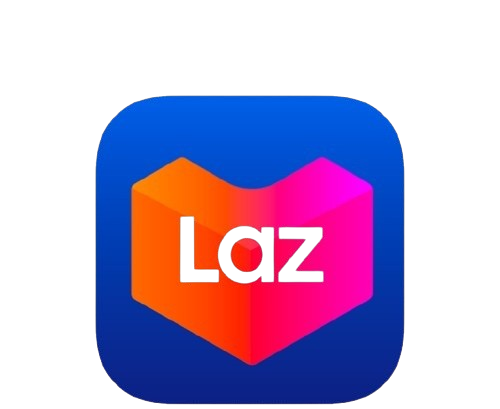

#  **Lazada Product Description Translation**
A Python script to translate long, HTML-formatted product descriptions from English to Malay using **`py-googletrans`** and **`BeautifulSoup`**.

## 🎯 Purpose

This script was created to address the challenge of translating long, HTML-formatted product descriptions from English to Malay, particularly in Lazada's bulk edit Excel files.

Initially, I attempted to use Google Sheets' built-in `GOOGLETRANSLATE` function, but it also translated HTML tags — breaking the formatting and structure. I then tried writing a custom Google Apps Script to isolate and translate only the text, but handling nested `<span>` tags required parsing the HTML into XML. End up spending extra time dealing with unexpected formatting issues. 

At that time, this issue was time-sensitive due to short notice that requires ecommerce stores to include Bahasa Malaysia in their product listings. To solve this properly, I switched to Python because its easiert to extract and replace text nodes without touching the HTML structure. 

## 📌 Example

### Input:
```html
  <p
    style="
      line-height: 1.7;
      text-align: left;
      text-indent: 0;
      margin-left: 0;
      margin-top: 0;
      margin-bottom: 0;
    "
  >
    <span
      style="
        font-weight: bold;
        text-decoration: underline;
        color: rgb(85, 85, 85);
        font-size: 18pt;
      "
      >ACTIVMAX Keto 3:1</span
    ><span style="color: rgb(102, 102, 102); font-size: 18pt"
      > is a nutritionally complete, ketogenic formula in a 3:1 ratio (fat:
      carbohydrate + protein) for the dietary management of intractable epilepsy
      and other medical conditions where the ketogenic diet is indicated;
      designed for infants and children. This formula is high in healthy fats
      and low in carbohydrates to optimize ketone bodies while providing a
      complete nutritional support for the growth and development of
      children.</span
    >
  </p>

```
### Output:
```html
  <p
    style="
      line-height: 1.7;
      text-align: left;
      text-indent: 0;
      margin-left: 0;
      margin-top: 0;
      margin-bottom: 0;
    "
  >
    <span
      style="
        font-weight: bold;
        text-decoration: underline;
        color: rgb(85, 85, 85);
        font-size: 18pt;
      "
      >Activmax Keto 3:1</span
    ><span style="color: rgb(102, 102, 102); font-size: 18pt"
      > adalah formula ketogenik yang lengkap dan nutrisi dalam nisbah 3:1
      (lemak:karbohidrat + protein) untuk pengurusan pemakanan epilepsi yang
      tidak dapat dikesan dan keadaan perubatan lain di mana diet ketogenik
      ditunjukkan; Direka untuk bayi dan kanak-kanak. Formula ini tinggi dalam
      lemak yang sihat dan rendah karbohidrat untuk mengoptimumkan badan keton
      sambil memberikan sokongan pemakanan yang lengkap untuk pertumbuhan dan
      perkembangan kanak-kanak.</span
    >
  </p>

```
## 🛠 Requirements

- Python 3.8 or later
- The following Python libraries:
  - pandas
  - openpyxl
  - beautifulsoup4
  - googletrans==4.0.2

## 🚀 How to Run

1. **Clone the repository:**

   ```bash
   git clone https://github.com/junhonglim49791/nutriq-product_description-translation.git
   
   cd nutriq-product_description-translation
   ```  
2. **Create a virtual environment:**  
    ```bash
    python3 -m venv venv
    source venv/bin/activate
    ```
3. **Install the required packages:**
    ```bash
    pip install -r requirements.txt
    ```
4. **Prepare your input Excel file:**  
  Assign the variable `original_file_name` with the name of your excel file

5. **Run the script:**
   ```bash
   python3 main.py
   ```
6. **Output:**  
After processing, a new Excel file will be generated that preserves the original structure. The existing `Main Description` column will be updated with the translated content.

## 🛒 How to Update Product Description in Lazada

1. **Download the Excel file** for your current product listings using **Bulk Edit**.  
   *(This is very important because we are overwriting the `English Decription Field` with the translations)*

    > **_Note:_** *This process is troublesome because Lazada does not provide a designated column for Malay descriptions in the Excel file — only on the web edit page.*


2. **Upload the translated Excel file** that includes the Malay descriptions using **Bulk Edit**.

3. In Lazada Seller Center, go to **Edit Product** (*yes, for each product*), then **copy and paste** the **translated Malay descriptions** from the `English Description Field` into the `Malay Description Field`.

4. Finally, **reupload your previously downloaded Excel file** that still contains the **original English descriptions** to overwrite them back in `English Description Field`.

5. Once completed, your product will have descriptions in both English and Malay. Customers will see the appropriate language version when they switch languages on Lazada.


## 📝 Translation Notes

- **Comma-heavy content (ingredient lists)  cause duplicate translations (Solved):**  
  Long strings are translated in chunks to improve translation accuracy.

- **Translation quality disclaimer:**  
  May produce awkward or inaccurate translations for some words in a sentence. However, after testing on **75 product descriptions**, it still provides **satisfactory results in most cases**.  
  👉 See the [🔍 Translation Accuracy Comparison](#-translation-accuracy-comparison) section for detailed examples and recommendations.

- **Empty rows are skipped:**  
  Rows without content in the `Main Description` column are ignored.

- **Limitations:**  
  The script uses the unofficial `googletrans` library, which depends on Google Translate’s web API. Therefore, this will not work at all times or could be blocked at anytime.

- **Missing space after bold text (Not solve):**  
   When bold formatting ends and is followed by a regular word, the space may be lost.

  For example:  
  `ACTIVMAX Keto 3:1 is` → `ACTIVMAX Keto 3:1adalah`

## 🔍 Translation Accuracy Comparison

The translation quality from `googletrans` is **not as accurate** as the official Google Translate on web or ChatGPT.

### 📌 Example 1
**Input:**  
*Cartilage is the connective tissue that covers the ends of your bones to form a smooth, shock-absorbing surface for your joints.*

| Source        | Translated Output |
|---------------|-------------------|
| `googletrans` | Rawan adalah tisu penghubung yang meliputi hujung tulang anda untuk **_membentuk permukaan yang menghilangkan dan menyerap yang licin_** untuk sendi anda. |
| Google Web    | Rawan adalah tisu penghubung yang menutupi hujung tulang anda untuk **_membentuk permukaan licin, menyerap kejutan untuk sendi anda._** |
| ChatGPT       | Rawan ialah tisu penghubung yang menutupi hujung tulang anda untuk **_membentuk permukaan yang licin dan menyerap hentakan_** bagi sendi-sendi anda. |

---

### 📌 Example 2
**Input:**  
*Choosing the right calcium is important, and elemental calcium is key because it represents the actual amount your body absorbs for bone growth and other health benefits.*

| Source        | Translated Output |
|---------------|-------------------|
| `googletrans` | Memilih kalsium yang betul **adalah _kalsium penting dan elemen adalah kunci_** kerana ia adalah jumlah sebenar kalsium badan anda menyerap untuk pertumbuhan tulang dan manfaat kesihatan yang lain. |
| Google Web    | Memilih kalsium yang betul **adalah _penting dan unsur kalsium adalah kunci_** kerana ia adalah jumlah sebenar kalsium yang diserap oleh badan anda untuk pertumbuhan tulang dan manfaat kesihatan yang lain. |
| ChatGPT       | Memilih kalsium yang tepat **_adalah penting, dan kalsium elemental merupakan kunci_** kerana ia adalah jumlah sebenar kalsium yang diserap oleh tubuh anda untuk pertumbuhan tulang dan manfaat kesihatan yang lain. |

---

> ⚠️ **Recommendation:**  
> This script was designed as a **quick fix** to help adapt product listings in response to sudden e-commerce policy changes requiring Bahasa Malaysia descriptions.
>
> It prioritizes **speed and HTML handling** over translation accuracy. If **high-quality translation** is critical for your use case:
> - Use service like the **Google Cloud Translation API**
> - Export the cleaned/plain text and translate using **Google Translate Web** or **ChatGPT**


